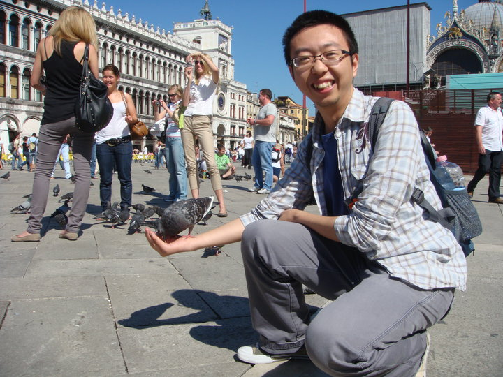

    

        
        

            <h1>Wenjun Hu</h1>
            

                
Welcome to my research portfolio. I am a Senior Staff AI Scientist with 10+ years of experience in Deep Learning, Computer Vision, Bayesian Machine Learning, Generative AI, and Large Language Models. My work focuses on developing foundational AI technologies and translating cutting-edge research into real-world applications that create significant impact across industries.

                
                
For more detailed explanations of my research interests and current projects, please explore the research area tabs below.

            

        

    

    
    

        <a href="mailto:nuaahwj@gmail.com" class="contact-item">
            <svg class="contact-icon" viewBox="0 0 24 24" fill="currentColor">
                <path d="M20 4H4c-1.1 0-1.99.9-1.99 2L2 18c0 1.1.9 2 2 2h16c1.1 0 2-.9 2-2V6c0-1.1-.9-2-2-2zm0 4l-8 5-8-5V6l8 5 8-5v2z"/>
            </svg>
            nuaahwj@gmail.com
        </a>
        <a href="https://scholar.google.com/citations?user=rCG_IBgAAAAJ&hl=en" class="contact-item" target="_blank">
            <svg class="contact-icon" viewBox="0 0 24 24" fill="currentColor">
                <path d="M5.242 13.769L0.5 9.5 12 1l11.5 8.5-4.742 4.269C17.548 14.359 14.899 14.5 12 14.5c-2.899 0-5.548-.141-6.758-.731z"/>
                <path d="M12 14.5c-2.899 0-5.548-.141-6.758-.731L0.5 18.5 12 23l11.5-4.5-4.742-4.731C17.548 14.359 14.899 14.5 12 14.5z"/>
            </svg>
            Google Scholar
        </a>
        <a href="https://www.linkedin.com/in/wenjunhuprofile/" class="contact-item" target="_blank">
            <svg class="contact-icon" viewBox="0 0 24 24" fill="currentColor">
                <path d="M20.447 20.452h-3.554v-5.569c0-1.328-.027-3.037-1.852-3.037-1.853 0-2.136 1.445-2.136 2.939v5.667H9.351V9h3.414v1.561h.046c.477-.9 1.637-1.85 3.37-1.85 3.601 0 4.267 2.37 4.267 5.455v6.286zM5.337 7.433c-1.144 0-2.063-.926-2.063-2.065 0-1.138.92-2.063 2.063-2.063 1.14 0 2.064.925 2.064 2.063 0 1.139-.925 2.065-2.064 2.065zm1.782 13.019H3.555V9h3.564v11.452zM22.225 0H1.771C.792 0 0 .774 0 1.729v20.542C0 23.227.792 24 1.771 24h20.451C23.2 24 24 23.227 24 22.271V1.729C24 .774 23.2 0 22.222 0h.003z"/>
            </svg>
            LinkedIn
        </a>
        <a href="https://github.com/phyhuhu" class="contact-item" target="_blank">
            <svg class="contact-icon" viewBox="0 0 24 24" fill="currentColor">
                <path d="M12 0c-6.626 0-12 5.373-12 12 0 5.302 3.438 9.8 8.207 11.387.599.111.793-.261.793-.577v-2.234c-3.338.726-4.033-1.416-4.033-1.416-.546-1.387-1.333-1.756-1.333-1.756-1.089-.745.083-.729.083-.729 1.205.084 1.839 1.237 1.839 1.237 1.07 1.834 2.807 1.304 3.492.997.107-.775.418-1.305.762-1.604-2.665-.305-5.467-1.334-5.467-5.931 0-1.311.469-2.381 1.236-3.221-.124-.303-.535-1.524.117-3.176 0 0 1.008-.322 3.301 1.23.957-.266 1.983-.399 3.003-.404 1.02.005 2.047.138 3.006.404 2.291-1.552 3.297-1.23 3.297-1.23.653 1.653.242 2.874.118 3.176.77.84 1.235 1.911 1.235 3.221 0 4.609-2.807 5.624-5.479 5.921.43.372.823 1.102.823 2.222v3.293c0 .319.192.694.801.576 4.765-1.589 8.199-6.086 8.199-11.386 0-6.627-5.373-12-12-12z"/>
            </svg>
            GitHub
        </a>

    

    <h2>Research Interests</h2>
    
    
My research is focused on developing methods that advance the state-of-the-art and address real-world challenges in industry.

    
    

        

            <button class="tab-button" onclick="showTab('genai')">Generative AI & LLMs</button>
            <button class="tab-button" onclick="showTab('computer-vision')">Computer Vision</button>
            <button class="tab-button" onclick="showTab('optimization')">Optimization & ML</button>
        

        
        

            

                <h3>Generative AI & Large Language Models</h3>
                
My work in generative AI focuses on developing more reliable and efficient language models through novel uncertainty quantification methods and data-efficient alignment techniques. I am particularly interested in creating multimodal systems that can seamlessly integrate text, image, and structured data to solve complex real-world problems.

                
                <h4>Current Research Focus</h4>
                <ul style="margin-bottom: 20px;">
                    <li>Data-efficient alignment techniques and fine-tuning for large language models</li>
                    <li>Proxy-based uncertainty estimation for improving instruction following</li>
                    <li>Retrieval-Augmented Generation (RAG) systems for knowledge-intensive tasks</li>
                    <li>Text-to-SQL generation and automated coding assistance</li>
                    <li>Graph learning approaches for RL alignment and structured reasoning</li>
                    <li>Multimodal LLMs for text, image, and tabular data integration</li>
                    <li><strong>Uncertainty-Aware AI:</strong> Developing methods that quantify and leverage uncertainty for more reliable AI systems</li>
                    <li><strong>Data Efficiency:</strong> Creating learning algorithms that achieve superior performance with minimal labeled data</li>
                    <li><strong>Industrial Translation:</strong> Bridging the gap between research innovations and practical industrial applications</li>
                    <li><strong>Human-AI Collaboration:</strong> Designing systems that effectively combine human expertise with AI capabilities</li>
                </ul>
                
                <a href="genai.html" class="explore-button">Explore Research</a>
            

        

        
        

            

                <h3>Computer Vision & Deep Learning</h3>
                
My computer vision research centers on developing intelligent systems that can learn effectively with minimal supervision while providing reliable uncertainty estimates. I focus on active learning frameworks and self-supervised methods that dramatically reduce annotation costs while maintaining high performance, particularly for medical and industrial applications.

                
                <h4>Research Contributions</h4>
                <ul style="margin-bottom: 20px;">
                    <li>Bayesian active learning frameworks for semantic segmentation</li>
                    <li>Self-supervised representation learning for 3D mesh analysis</li>
                    <li>Uncertainty-aware computer vision for medical imaging</li>
                    <li>Multi-view 3D semantic segmentation systems</li>
                    <li><strong>Uncertainty-Aware AI:</strong> Developing methods that quantify and leverage uncertainty for more reliable AI systems</li>
                    <li><strong>Data Efficiency:</strong> Creating learning algorithms that achieve superior performance with minimal labeled data</li>
                    <li><strong>Industrial Translation:</strong> Bridging the gap between research innovations and practical industrial applications</li>
                    <li><strong>Human-AI Collaboration:</strong> Designing systems that effectively combine human expertise with AI capabilities</li>
                </ul>
                
                <a href="computer-vision.html" class="explore-button">Explore Research</a>
            

        

        
        

            

                <h3>Optimization & Machine Learning</h3>
                
My optimization research bridges mathematical optimization theory with practical machine learning applications, focusing on Bayesian methods that provide principled uncertainty quantification. I develop frameworks that enable robust, efficient decision-making in complex engineering and business environments where understanding uncertainty is critical for safe and effective AI deployment.

                
                <h4>Key Methodologies</h4>
                <ul style="margin-bottom: 20px;">
                    <li>Gaussian Process frameworks for process optimization</li>
                    <li>Bayesian optimization for hyperparameter tuning and design</li>
                    <li>Uncertainty quantification in complex engineering systems</li>
                    <li>Predictive analytics for industrial applications</li>
                    <li><strong>Uncertainty-Aware AI:</strong> Developing methods that quantify and leverage uncertainty for more reliable AI systems</li>
                    <li><strong>Data Efficiency:</strong> Creating learning algorithms that achieve superior performance with minimal labeled data</li>
                    <li><strong>Industrial Translation:</strong> Bridging the gap between research innovations and practical industrial applications</li>
                    <li><strong>Human-AI Collaboration:</strong> Designing systems that effectively combine human expertise with AI capabilities</li>
                </ul>
                
                <a href="optimization.html" class="explore-button">Explore Research</a>
            

        

    

    <h2>Recent Publications</h2>
    
For a complete list of publications and citations, please visit my <a href="https://scholar.google.com/citations?user=rCG_IBgAAAAJ&hl=en" target="_blank">Google Scholar profile</a>.

    
    

        <strong>Improving instruction following in language models through proxy-based uncertainty estimation</strong> 
        <em>International Conference on Machine Learning (ICML), 2024</em> 
        
Novel uncertainty-aware reward model that significantly improves LLM alignment with reduced human feedback requirements. Demonstrates substantial improvements on Vicuna and MT-bench evaluations.

    

    
    

        <strong>Bayesian active learning for semantic segmentation</strong> 
        <em>arXiv:2408.01694, 2024</em> 
        
Introduces Beta distribution approximation for efficient uncertainty estimation in semantic segmentation, achieving significant annotation cost reductions.

    

    
    

        <strong>Self-Supervised contrastive representation learning for 3D mesh segmentation</strong> 
        <em>arXiv:2208.04278, 2022</em> 
        
Pioneering self-supervised approach for 3D geometric data analysis, eliminating the need for manual annotations in mesh segmentation tasks.

    

    
    

        <strong>Active learning performance in labeling radiology images is 90% Effective</strong> 
        <em>Frontiers in Radiology, 2021</em> 
        
Clinical validation demonstrating dramatic reduction in radiologist annotation burden while maintaining diagnostic accuracy.

    

    
    

        <strong>Modeling and optimizing process parameters in sputtering systems using Gaussian processes</strong> 
        <em>IEEE Transactions on Semiconductor Manufacturing, 2021</em> 
        
Industrial application of Bayesian optimization resulting in significant yield improvements and cost reductions in semiconductor manufacturing.

    

    <h2>Education</h2>
    
    

        
May 2014

        
Ph.D. & M.S. in Mechanical Engineering

        
Georgia Institute of Technology | Atlanta, GA

    

    
    

        
May 2005

        
B.S. in Mechanical Engineering

        
University of Tehran | Tehran, Iran

    

    <h2>Professional Background</h2>
    
    

        
Feb 2019 – Present

        
Senior Staff AI Scientist

        
AI Science Lab, Samsung SDS | San Jose, CA

        
<em>Promoted to Senior Staff AI Scientist in 2024</em>

        
        <h4>Key Responsibilities:</h4>
        <ul>
            <li>Develop and deploy products, solutions, and service-differentiating technologies to secure Samsung's competitive advantages</li>
            <li>Establish technical goals, lead task forces, and collaborate across Samsung and external entities for technology development and transfer</li>
        </ul>
        
        <h4>Major Projects:</h4>
        <ul>
            <li><strong>Generative AI & Large Language Models:</strong> Developed Text-to-SQL models, data-efficient LLM alignment techniques, and tailored multimodal LLMs for text, image, and tabular data formats</li>
            <li><strong>Data-Efficient Deep Learning:</strong> Created representation and unsupervised learning algorithms to reduce labeling requirements for deep learning models</li>
            <li><strong>Computer Vision:</strong> Developed Active Learning and Unsupervised Accuracy Estimation frameworks for classification, object detection, and semantic segmentation; created probabilistic Multi-View 3D semantic segmentation Active Learning framework</li>
            <li><strong>Predictive Analytics:</strong> Built sales forecasting models for Samsung business units and optimized marketing strategies for sales campaigns</li>
        </ul>
    

    
    

        
Nov 2017 – Feb 2019

        
Senior Data Scientist

        
Data Science Group, Applied Materials | Santa Clara, CA

        <ul>
            <li>Developed and deployed AI solutions to enhance engineering, services, and supply chain performance</li>
            <li>Led AI application productization in collaboration with Software, UI, DevOps teams, and internal/external customers</li>
            <li>Created end-of-life prediction Deep Learning and Machine Learning models for SmartFactory service solutions</li>
            <li>Deployed real-time Deep Learning anomaly detection web application for semiconductor smart manufacturing platform</li>
            <li>Developed Gaussian Process Machine Learning framework for modeling process and equipment parameter impacts on sputtering systems (collaboration with MIT)</li>
        </ul>
    

    
    

        
Aug 2014 – Nov 2017

        
Research Engineer

        
Probabilistic Lab, GE Global Research | San Ramon, CA & Niskayuna, NY

        <ul>
            <li>Developed probabilistic methods and machine learning models for calibration, validation, uncertainty quantification, optimization, and meta-modeling</li>
            <li>Created defect detection software for manufacturing processes</li>
            <li>Contributed to GE's internal Gaussian Process Python package and Uncertainty Quantification application</li>
            <li>Developed Bayesian Machine Learning solutions for life cycle prediction, design space optimization, and supply chain management</li>
            <li>Built real-time defect recognition and image processing software for 3D CT composite data</li>
        </ul>
    

    
    

        
Aug 2009 – May 2014

        
Research Assistant

        
Georgia Institute of Technology | Atlanta, GA

        <ul>
            <li>Conducted research in Computer-Aided Engineering (CAE), Topological Optimization, and Image Processing</li>
            <li>Developed periodic surface parametric models to represent topology of porous microstructures</li>
            <li>Performed topological characterization and optimization of 3D composite porous microstructures</li>
        </ul>
    

